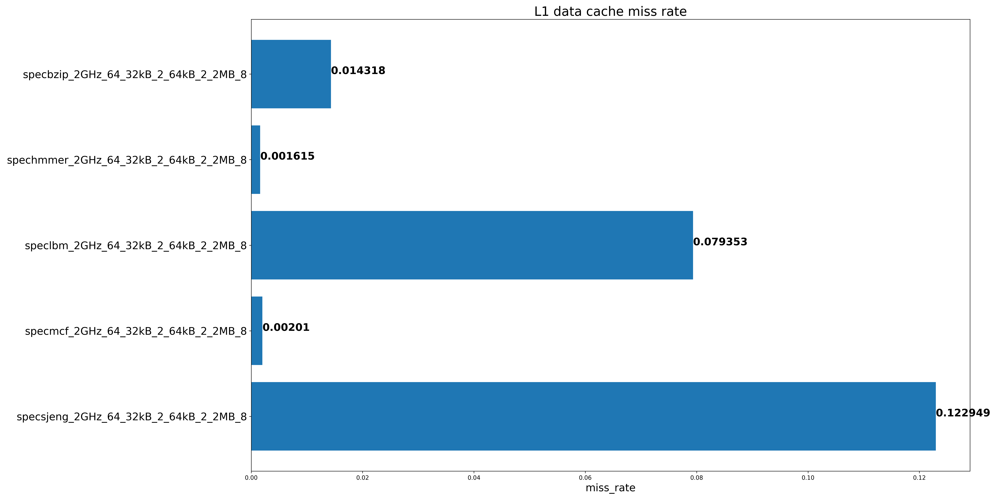
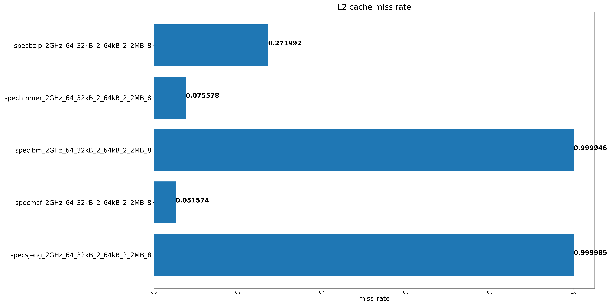
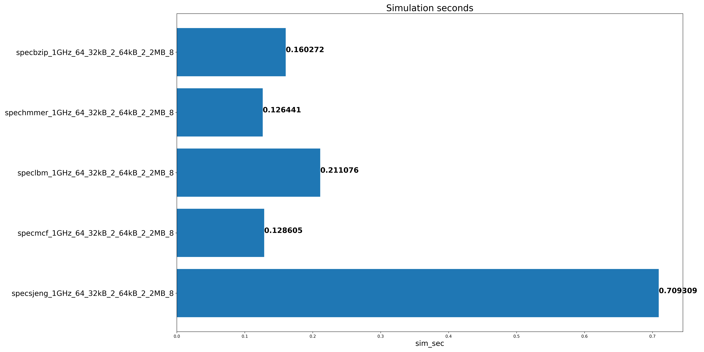
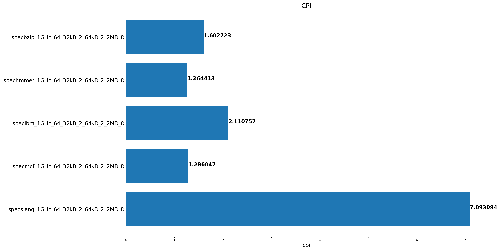

# Assignment 2

## Βήμα 1

### Ερώτημα 1

Τρέχοντας τα benchmark με τα default options, με την χρήση του [script](./gem5_outputs/get_data.sh) παίρνουμε τα εξής δεδομένα:
| **Key** | **Value** |
| :-------------------------- | :-------: |
| **L1 icache size** | 32kB |
| **L1 icache associativity** | 2 |
| **L1 dcache size** | 64kB |
| **L1 dcache associativity** | 2 |
| **L2 cache size** | 2MB |
| **L2 cache associativity** | 8 |
| **Cache Line size** | 64 |

Γενικά τα δεδομένα που κάνει output το [script](./gem5_outputs/get_data.sh) είναι στην μορφή
`benchmark_clockSpeed_CacheLineSize_icacheSize_icacheAssoc_dcacheSize_dcacheAssoc_l2CacheSize_lwCacheAssoc`
Άρα τα default options είναι `2GHz_64_32kB_2_64kB_2_2MB_8`

### Ερώτημα 2

Με την χρήση αυτού του [script](assignment2/gem5_outputs/step1_q2.py) παίρνουμε τα εξής σχεδιαγράμματα:

##### Παρατηρήσεις

- Τα benchmark με τα μεγαλύτερα cpi έχουν και μεγαλύτερο χρόνο εκτέλεσης καθώς και πολλά misses στην L1 dcache και L2 cache
- Το speclbm και specsjeng έχουν σχεδόν πάντα miss στην L2 cache

### Ερώτημα 3

Τρέχοντας ένα benchmark με default options βλέπουμε το `system.clk_domain.clock = 1000` δηλαδή το ρολόι χρονισμού του host
system είναι 1GHz και το `system.cpu_clk_domain = 500` δηλαδή το ρολόι χρονισμού του simulated cpu είναι 2GHz.
Τρέχοντας ξανά το benchmark με `--cpu-clock=1GHz` βλέπουμε το `system.clk_domain.clock = 1000` δηλαδή ίδιο με πριν
και το `system.cpu_clk_domain = 1000` δηλαδή το ρολόι χρονισμού του simulated cpu έγινε 1GHz.

Βλέποντας τα διαγράμματα για **Simulated seconds** και **CPI** με options `1GHz_64_32kB_2_64kB_2_2MB_8`:

Παρατηρούμε ότι υπάρχει τέλειο scaling αφού μειώνοντας το clock στο μισό τα benchmarks χρειάστηκαν στον διπλάσιο χρόνο.
Εκτός απο τα speclbm και specsjeng που λόγω των πολλών miss στην L2 cache υπάρχει καθυστέρηση ανεξάρτητη του clock.
