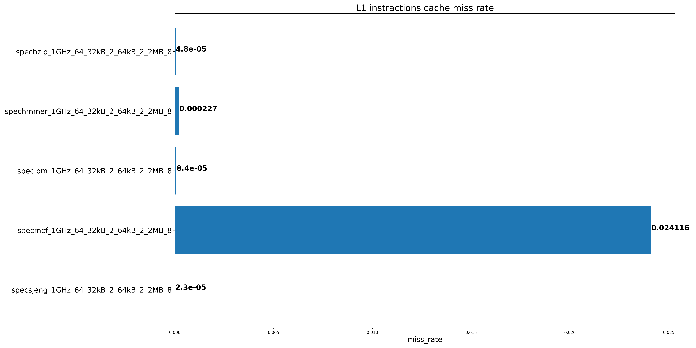
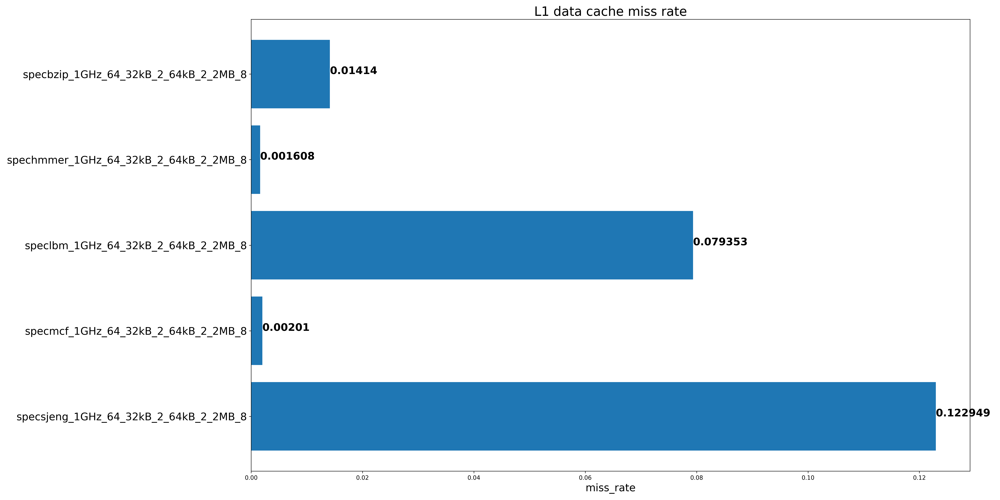
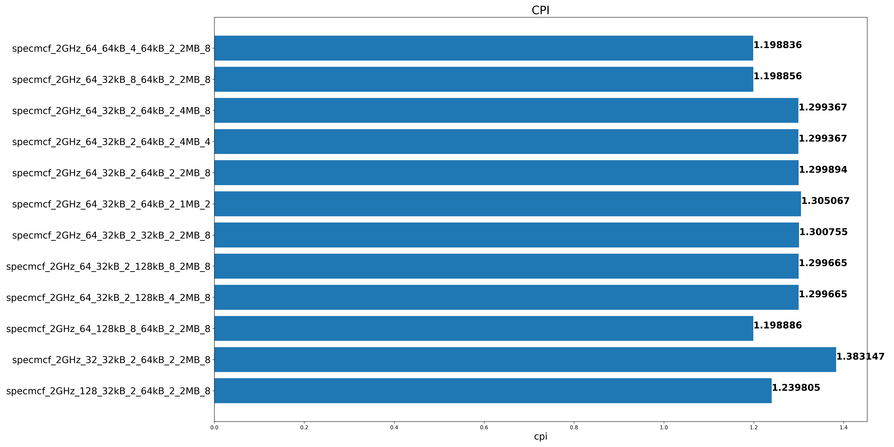
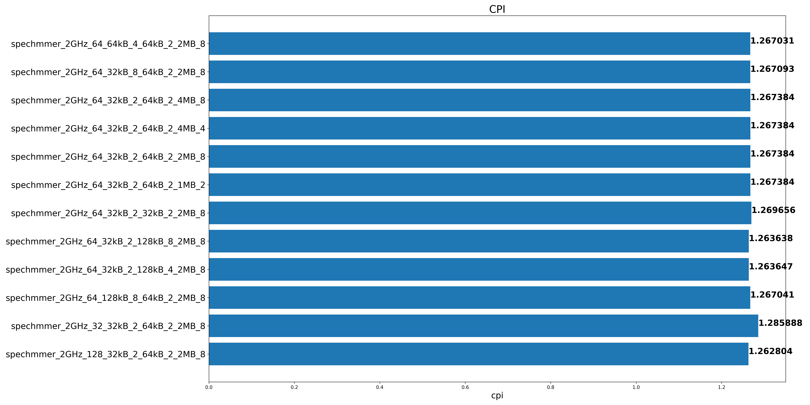
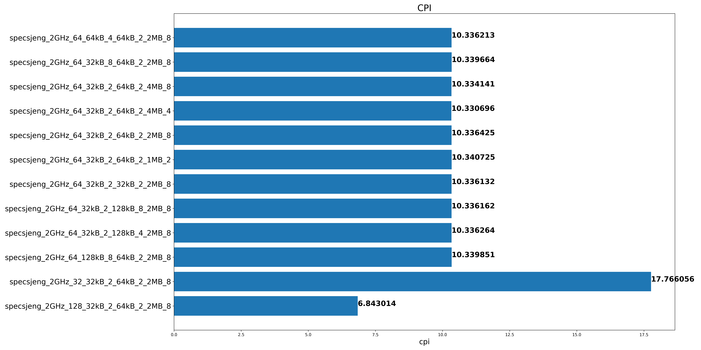
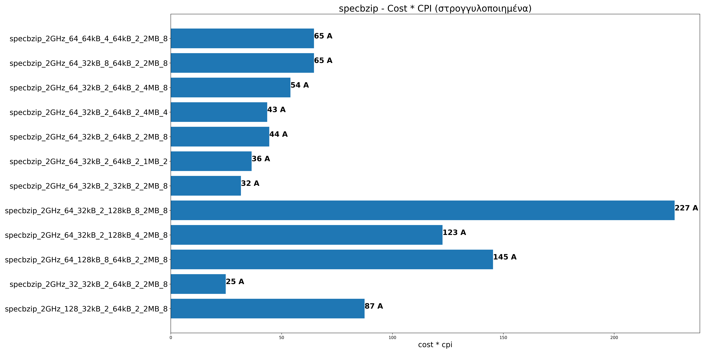
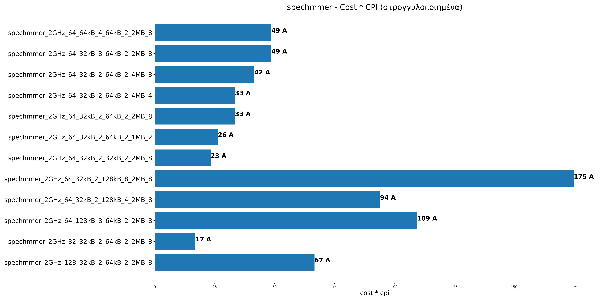
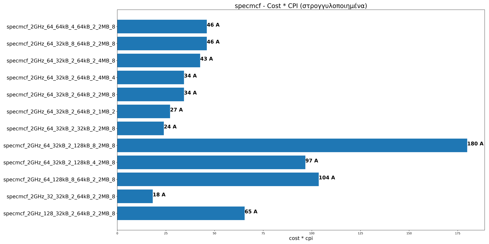
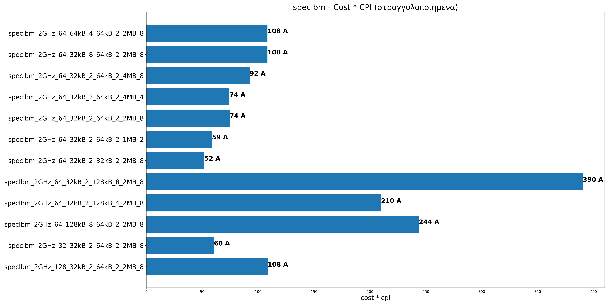

# Assignment 2

## Βήμα 1

### Ερώτημα 1

Τρέχοντας τα benchmark με τα default options, με την χρήση του [script](./gem5_outputs/get_data.sh) παίρνουμε τα εξής δεδομένα:
| **Key** | **Value** |
| :-------------------------- | :-------: |
| **L1 icache size** | 32kB |
| **L1 icache associativity** | 2 |
| **L1 dcache size** | 64kB |
| **L1 dcache associativity** | 2 |
| **L2 cache size** | 2MB |
| **L2 cache associativity** | 8 |
| **Cache Line size** | 64 |

Γενικά τα δεδομένα που κάνει output το [script](./gem5_outputs/get_data.sh) είναι στην μορφή
`benchmark_clockSpeed_CacheLineSize_icacheSize_icacheAssoc_dcacheSize_dcacheAssoc_l2CacheSize_lwCacheAssoc`
Άρα τα default options είναι `2GHz_64_32kB_2_64kB_2_2MB_8`

### Ερώτημα 2

Με την χρήση αυτού του [script](./gem5_outputs/step1_q2.py) παίρνουμε τα εξής σχεδιαγράμματα:

##### Παρατηρήσεις

- Τα benchmark με τα μεγαλύτερα cpi έχουν και μεγαλύτερο χρόνο εκτέλεσης καθώς και πολλά misses στην L1 dcache και L2 cache
- Το speclbm και specsjeng έχουν σχεδόν πάντα miss στην L2 cache

### Ερώτημα 3

Τρέχοντας ένα benchmark με default options βλέπουμε το `system.clk_domain.clock = 1000` δηλαδή το ρολόι χρονισμού του host
system είναι 1GHz και το `system.cpu_clk_domain = 500` δηλαδή το ρολόι χρονισμού του simulated cpu είναι 2GHz.
Τρέχοντας ξανά το benchmark με `--cpu-clock=1GHz` βλέπουμε το `system.clk_domain.clock = 1000` δηλαδή ίδιο με πριν
και το `system.cpu_clk_domain = 1000` δηλαδή το ρολόι χρονισμού του simulated cpu έγινε 1GHz.

Βλέποντας τα διαγράμματα για options `1GHz_64_32kB_2_64kB_2_2MB_8`:

Παρατηρούμε ότι υπάρχει τέλειο scaling αφού μειώνοντας το clock στο μισό τα benchmarks χρειάστηκαν στον διπλάσιο χρόνο.
Εκτός απο τα speclbm και specsjeng που λόγω των πολλών miss στην L2 cache υπάρχει καθυστέρηση ανεξάρτητη του clock.

# Βήμα 2

Από το 1ο βήμα της εργασίας σχετικά με τα CPI, L1 data και instruction miss rates, L2 miss rates και simulated
seconds προέκυψαν ορισμένα γραφήματα.
Με τη βοήθειά τους, μπορούμε να προχωρήσουμε σε συγκεκριμένες αλλαγές των χαρακτηριστικών της για την
βελτιστοποίηση του CPI. Για παράδειγμα, το specbzip έχει υψηλά L1 data miss rates και L2 cache miss rates.
Επομένως, για τη μείωση του CPI, θα πρέπει να αλλάξουμε τo μέγεθος και associativity της L1 data cache για
την πρώτη περίπτωση, και τo μέγεθος και associativity της L2 για τη δεύτερη. Με την ίδια λογική συνεχίζει
και η ακόλουθη ανάλυση :

## Ανάλυση

### Specbzip

Απαιτείται κυρίως αλλαγή της L1 data cache και L2 cache.

Από το αρχείο με τα L1 data miss rate, για την L1 data cache προτείνονται οι βελτιώσεις:

- Αύξηση του μεγέθους(από τα 64kB σε 128kB)
- Αύξηση του associativity (από 2 σε 8)
- Αύξηση του μεγέθους της cache line (από 64 σε 128)

Από το αρχείο σχετικά με το L2 miss rate, για την L2 cache προτείνονται οι βελτιώσεις:

- Αύξηση του assocciativity (ουσιαστικά σταθεροποίηση στο default option 8 αν όχι ακόμη μεγαλύτερο που γενικά αντενδείκνυται -βλ. βήμα 3ο-)
- Αύξηση του μεγέθους cache line (από 64Β σε 128Β)

[Περισσότερα διαγράμματα](./graphs/step2/specbzip/)

### Specmcf

Απαιτείται κυρίως αλλαγή της L1 instruction cache.

Από το αρχείο με τα L1 instruction miss rate, για την L1 instruction cache προτείνονται οι βελτιώσεις:

- Αύξηση του μεγέθους (από 32kB σε 128kB)
- Αύξηση του assocciativity (από 2 σε 8)

[Περισσότερα διαγράμματα](./graphs/step2/specmcf/)

### Spechmmer

Απαιτείται κυρίως αλλαγή της L1 instruction cache (παρότι είναι από τα προγράμματα που εκτελέστηκαν
αποτελεσματικότερα για τα default χαρακτηριστικά cpu από τον gem5 δίνοντας το μικρότερο CPI μεταξύ των benchmarks).

Από το αρχείο με τα L1 instruction miss rate, για την L1 instruction cache προτείνονται οι βελτιώσεις:

- Αύξηση του μεγέθους (από 32kB σε 128kB)
- Αύξηση του associativity (από 2 σε 8)

[Περισσότερα διαγράμματα](./graphs/step2/spechmmer/)

### Specsjeng

Απαιτείται κυρίως αλλαγή της L1 data cache και της L2 cache.

Από το αρχείο με τα L1 data cache miss rate, για τις caches προτείνεται:
specsjeng

- Αύξηση του μεγέθους cache line (από 64Β σε 128B)

Από το αρχείο με τα L2 cache miss rate, η αύξηση του μεγέθους και του associativity
έχει αμελητέα διαφορά στο L2 miss rate και γι' αυτό οι προτεινόμενες αλλαγές για το
συγκεκριμένο benchmark περιορίζονται στην παραπάνω αλλαγή του μεγέθους της cache line.

[Περισσότερα διαγράμματα](./graphs/step2/specsjeng/)

### Speclbm

Απαιτείται κυρίως αλλαγή της L1 data cache και της L2 cache.

Από το αρχείο με τα L1 data cache miss rate, για τις caches προτείνεται:

- Αύξηση του μεγέθους της cache line (από 64B σε 128Β)

Παρόμοια με το αρχείο των L2 cache miss rates για το specjeng, έτσι και για το αρχείο των L2 cache
miss rates για το speclibm φαίνeται οτι με αύξηση του μεγέθους της L2 cache ή του associativity
υπάρχει αμελητέα βελτίωση του L2 miss rate. Για λόγο αυτό, οι προτάσεις βελτίωσης περιορίζονται και
για αυτό το benchmark στην παραπάνω αλλαγή της αύξησης του μεγέθους της cache line.

[Περισσότερα διαγράμματα](./graphs/step2/speclbm/)

## Παρατηρήσεις:

1. Στις περιπτώσεις benchmarks που μειονεκτήματα είναι τα μεγάλα miss rates σε L1 (data ή και instruction) και L2 cache φαίνεται οτι η αύξηση των αντίστοιχων μεγεθών cache και του associativity αίρει αυτά τα μειονεκτήματα και, κατα συνέπεια, οδηγεί σε καλύτερο CPI. Τέτοια benchmarks είναι τα specbzip και specmcf.
2. Ωστόσο, υπάρχουν και benchmarks που δεν υπάγονται στην παραπάνω κατηγορία, αφού σε αυτά, η αύξηση του μεγέθους των caches δε φαίνεται να οδηγεί σε μείωση του CPI. Τα specjeng και speclibm αποτελούν χαρακτηριστικά παραδείγματα. Κοινό χαρακτηριστικό και των δύο είναι η άκαμπτη αντίδραση των L2 miss rates στην αύξηση του μεγέθους και του associativity της L2. Σε αυτά, μόνο η αύξηση του μεγέθους της cache line φαίνεται να οδηγεί στο βέλτιστο CPI.
3. Συνοψίζοντας, από την ανάλυση του CPI του προσωμοιούμενου επεξεργαστή για τις διάφορες παραμέτρους του, προκύπτει οτι η βελτιστοποίησή του για το εκάστοτε benchmark περιστρέφεται γύρω από τον άξονα της αύξησης των μεγεθών και του associativity των caches. Η αύξηση του μεγέθους της cache lines συντελεί στον ίδιο σκοπό.

# Βήμα 3

Μία συνάρτηση κόστους η οποία να λαμβάνει υπόψη της τα χαρακτηριστικά του cpu που μελετήθηκαν στα προηγούμενα βήματα είναι η εξής:

> Κ = [Α(L1i\_size/32kB \* L1i\_assoc) + B(L1d\_size/32kB \* L1d\_assoc) + C(L2\_size/1MB \* L2\_assoc)] \* cache_line_size/32

όπου Α,Β και C σταθερές που περιγράφουν το κατασκευαστικό κόστος της αντίστοιχης cache προς το μέγεθός σε bytes.

Λαμβάνοντας υπόψη ότι

1. Η L1 είναι πιο ακριβή ανα byte από την L2 μπορούμε να θεωρήσουμε οτι A = 5 C.
2. Η L1 instruction cache είναι πιο ακριβής, και επομένως πιο φθηνή, σε σχέση με τη data cache.
   Αυτό οφείλεται στο οτι οι εντολές που χρησιμοποιούνται από τις cpus για προγράμματα στη συνήθη περίπτωση
   είναι συγκεκριμένες (πχ load, condtional branch, compare, store κοκ)\*[1].
   Αντίθετα, η data cache έχει υψηλότερα miss rates από την instruction cache. Αυτό γίνεται σαφές και από τις
   εκτελέσεις των benchmarks. Για κάθε εκτέλεση ανεξάρτητα των τιμών των παραμέτρων, βλέπουμε data miss rate > instruction miss rate.

Έτσι, μπορούμε να θέσουμε Β = 2 \* Α.

Λύνοντας ως προς Α τη συνάρτηση κόστους, αυτή απλοποιείται στη μορφή:

> Κ = Α\*[(L1i\_size/32kB \* L1i\_assoc) + 2\*(L1d\_size/32kB \* L1d\_assoc) + 0.2(L2\_size/1MB \* L2\_assoc)] \* cache_line_size/32

Μπορούμε λοιπόν να θεωρήσουμε την **αυθαίρετη μονάδα κόστους Α** για την αποτίμηση της αρχιτεκτονικής με τα παραπάνω χαρακτηριστικά.

Για να αποφανθούμε σχετικά με την αρχιτεκτονική που θα εφαρμόσουμε θα πρέπει να επιλέξουμε εκείνες τις τιμές των παραμέτρων
που ελαχιστοποιούν την συνάρτηση κόστους - χρόνου εκτέλεσης. Αυτή μπορεί να εκφραστεί για κάθε benchmark ως εξής:

func = K \* CPI

όπου Κ η συνάρτηση κόστους για τις συγκεκριμένες τιμές των παραμέτρων και CPI το CPI που βρέθηκε στο βήμα 2.
Το CPI επιλέχθηκε επειδή συμβαδίζει με τα sim_seconds και η ελαχιστοποίησή του σημαίνει μεγιστοποίηση της ταχύτητας.

Προφανώς και η καλύτερη επιλογή είναι αυτή με την μικρότερη τιμή στα παρακάτω διαγράμματα (generated by this [script](./gem5_outputs/step3.py)):

\*Σχόλιο: Στην εικόνα της παραπομπής (σελ.610) τα δεδομένα αφορούν στην x86 και όχι στην ARM αρχιτεκτονική.
Παρόλ' αυτά διευκρινίζεται στη συνέχεια οτι οι ίδιες εντολές αποτελούν τη συνήθη περίπτωση σε όλο το σύνολο
των υπολογιστών ( εννοείται εμπορικής χρήσης καθώς σε επιστημονικές εφαρμογές η συνήθης περίπτωση χρησιμοποιούμενων
εντολών είναι διαφορετική).

Πηγές
_[1] Hennessy and Patterson,Αρχιτεκτονική Υπολογιστών,σελ.610-611._
