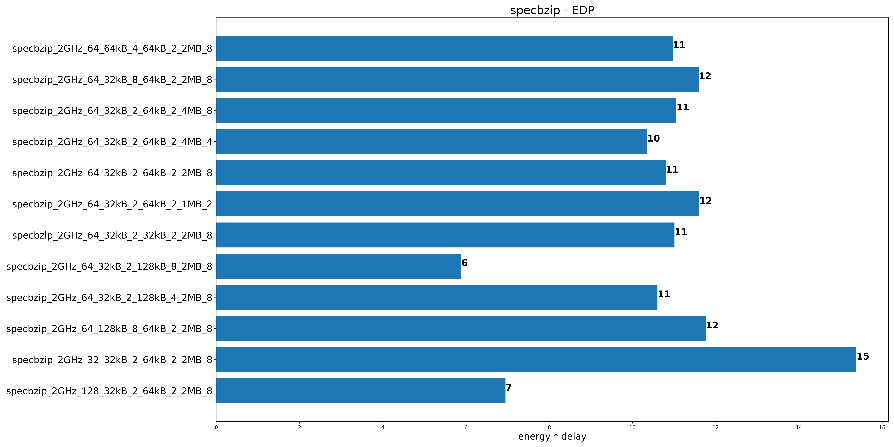
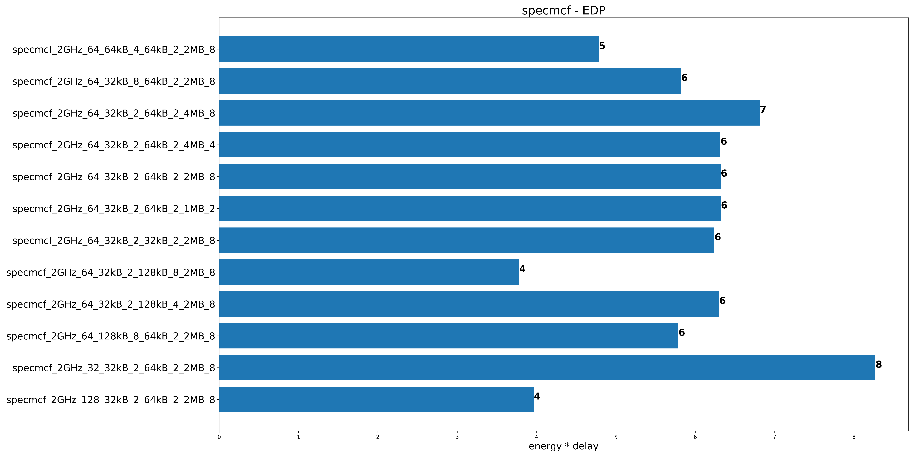

# Ομάδα 3

**Στεφανίδης Ιωάννης, ΑΕΜ: 9587**

**Τοπαλίδης Στυλιανός, ΑΕΜ: 9613**

# Assignment 3

## Βήμα 1

### Ερώτημα 1

#### Dynamic Power

Η έννοια dynamic power αφορά στην ωφέλιμη ισχύ που καταναλώνεται κατα τη λειτουργία
κυκλώματος αποτελούμενου από ένα ή περισσότερα τρανζίστορ και αποτελεί τυπικά το 90% της
συνολικής παραγόμενης ισχύος [1]. Στην περίπτωση ενός σύνθετου κυκλώματος, όπως ο
επεξεργαστής, το dynamic power αφορά στη συνολική ισχύ που καταναλώνει.

#### Leakage Power

Γενικά το leakage power αφορά στη διαρροή ισχύος από το υλικό ενός
συστήματος. Τέτοια διαρροή μπορεί να οφείλεται για παράδειγμα στην ανεπαρκή
μόνωση των χάλκινων καλωδίων.
Στην περίπτωση των τρανζίστορ, leakage αφορά στην μη ωφέλιμη ισχύ που
παράγεται κατά τη ροή ρεύματος μέσω των φορτισμένων πυκνωτών τους όταν αυτά
δε βρίσκονται σε κατάσταση λειτουργίας [2]. Πρόκειται για την ισχύ απωλειών
του επεξεργαστή όταν αυτός δεν εκτελεί κάποια εργασία ( π.χ. όταν περιμένει
να διαβάσει δεδομένα από τη μνήμη).

#### Διαφορά των δύο

Στο πλαίσιο των προσομοιούμενων χαρακτηριστικών του επεξεργαστή , η διαφορά τους είναι οτι
η μεν dynamic power είναι η επιθυμητή ισχύς ,υπο την έννοια οτι χρησιμοποιείται για τη
λειτουργία του επεξεργαστή, η δε leakage power είναι η ισχύς απωλειών.

#### Ποιό από τα παραπάνω δύο είδη ισχυών αλλάζουν με την εκτέλεση διαφορετικών προγραμμάτων;

Από [1] σελ.8 προκύπτει οτι η dynamic power εξαρτάται από τη συχνότητα λειτουργίας των
τρανζίστορ του επεξεργαστή. Προγράμματα με μεγάλες υπολογιστικές απαιτήσεις προκαλούν
και υψηλές συχνότητες λειτουργίας των τρανζίστορ και άρα υψηλά dynamic power.

Για παράδειγμα, προγράμματα με πολλές add, sub, branch κοκ απαιτούν περισσότερο χρόνο
επεξεργασίας και αφήνουν πιο σπάνια τον επεξεργαστή σε αδράνεια αυξάνοντας το dynamic power.
Αντίθετα, ένα πρόγραμμα με περισσότερες load και store περνά τον έλεγχο στη μνήμη και αφήνει
τον επεξεργαστή πιο αδρανή μειώνοντας έτσι το dynamic power.

Από την άλλη, η leakage power δεν εξαρτάται από τη συχνότητα λειτουργίας των τρανζίστορ
δηλαδή από το υπολογιστικό φορτίο. Έτσι παραμένει η ίδια για κάθε πρόγραμμα που εκτελείται.

#### Πώς επηρεάζει ο χρόνος εκτέλεσης του προγράμματος την καταναλισκόμενη ισχύ;

Ο χρόνος εκτέλεσης ενός προγράμματος δεν παίζει ρόλο στην ισχύ σε καμία περίπτωση (ούτε
στο leakage power ούτε στο dynamic power).

Για να γίνει αυτό κατανοητό αρκεί να αντιπαραβάλουμε την εκτέλεση ενός προγράμματος Α με
την εκτέλεση του ίδιου προγράμματος Α δύο φορές συνεχόμενα. Επειδή σε κάθε χρονική στιγμή
εκτελείται το ίδιο πρόγραμμα οι δύο περιπτώσεις εκτελέσεων θα έχουν την ίδια ισχύ άσχετα αν η
δεύτερη περίπτωση εκτελείται για μεγαλύτερο χρόνο.

Αυτό που αλλάζει είναι η ενέργεια που παράγεται και για το Α είναι σίγουρα μικρότερη από το 2A.

### Ερώτημα 2

#### Μπορεί ο επεξεργαστής 40W να εξασφαλίζει μεγαλύτερη διάρκεια ζωής μπατατίας από αυτόν με 4W;

Για να ελέγξουμε αν ο επεξεργαστής 40W (έστω 1) μπορεί να οδηγεί σε μεγαλύτερη διάρκεια
ζωής μπαταρίας από τον 4W (έστω 2) θα τους τεστάρουμε υπο το ίδιο υπολογιστικό φορτίο. Έστω
λοιπόν οτι ο 1 απαιτεί χρόνο Δt1 για την εκτέλεση ενός προγράμματος ενώ ο 2 απαιτεί Δt2 για το
ίδιο πρόγραμμα. Τότε η κατανάλωση (ενέργειας) της μπαταρίας σε κάθε περίπτωση θα είναι θα
είναι:

```
Εμπατ1=P1*Δt1
Εμπατ2=P2*Δt2
```

για τον 1 και τον 2 αντίστοιχα.

Θεωρούμε οτι P1 και P2 περιλαμβάνουν την ολική
ισχύ που δίνεται από τη μπαταρία και επομένως περιλαμβάνει τόσο τη χρήσιμη (dynamic) όσο και
την ισχύ απωλειών (leakage).
Ο 1 θα έχει μικρότερη κατανάλωση ενέργειας και άρα μεγαλύτερη διάρκεια ζωής μπαταρίας αν

```
Εμπατ1 < Εμπατ2 =>  P1*Δt1  < P2*Δt2  => 40*Δt1  < 4*Δt2  => Δt1  < Δt2  /10
```

δηλαδή αρκεί ο επεξεργαστής 1 να εκτελεί το ίδιο πρόγραμμα περισσότερο από 10 φορές πιο
γρήγορα έτσι ώστε να εξασφαλίζει μικρότερη ενεργειακή κατανάλωση.

Επομένως, το McPAT χρειάζεται επιπλέον και πληροφορίες για το χρόνο εκτέλεσης του
προγράμματος που θα χρησιμοποιηθεί για τη σύγκριση . Αυτές τις πληροφορίες μπορεί να τις δώσει
ένας εξομοιωτής επεξεργαστών που είναι και απαιτούμενο συνοδευτικό εργαλείο του McPAT[3] .
“2Α” εξαιτιας του μικρότερου χρόνου εκτέλεσης.

### Ερώτημα 3

#### Xeon

```
Runtime Dynamic = 72.9199 W
Total leakage = 36.8319 W
PXeon  = Runtime Dynamic +Total leakage = 109.7518W
```

#### ARM A9 2GHz

```
Runtime Dynamic =  2.96053 W
Total leakage  = 0.108687W
PARΜ =  Runtime Dynamic +Total leakage = 3.0692W
```

άρα `PXeon/PARM = 109.7518 / 3.0692 ~ 35.75.`<br>
Από την εκφώνηση θεωρούμε, ακόμη, οτι για την εκτέλεση του ίδιου προγράμματος
ΔtARM=40ΔtXeon (ο Xeon είναι 40 φορές πιο γρήγορος ) . Από αυτό και την ανάλυση του
ερωτήματος 2 προκύπτει για την ενεργειακή κατανάλωση :<br>
`EXeon = PXeon * ΔtXeon` και `EARM= PARΜ* ΔtARΜ`
άρα με `EXeon = PXeon * ΔtXeon = 35.75 PARΜ * 1/40 = 0.894 EARM` δηλαδή ο Xeon είναι πιο
ενεργειακά αποδοτικός μόνο όσον αφορά στην εκτέλεση του προγράμματος.<br>
Ωστόσο, δεδομένου οτι δεν απενεργοποιείται **ο Xeon μετά την εκτέλεση του προγράμματος
σίγουρα δαπανά περισσότερη ενέργεια και άρα μακροπρόθεσμα είναι λιγότερο αποδοτικός.**

## Βήμα 2

### Ερώτημα 1






#### Παρατηρήσεις

1. Αύξηση της data cache προκαλεί μείωση του EDP
2. Αύξηση της instruction cache προκαλεί αμελητέα μείωση του EDP (η διαφορά
   φαίνεται
   μόνο στα speclbm και specjeng) (γραμμές 2η και 3η απ’ το τέλος)
3. Μείωση της L2 cache προκαλεί μικρή μείωση του EDP (γραμμές 3η και 5η)
4. Αύξηση της cache line size προκαλεί μείωση του EDP (γραμμές 8η και 9η)
   Ιδιαίτερη σημασία στα specjeng και speclbm παίζει το cache line size (βλ.
   τελευταίες
   γραμμές)

### Ερώτημα 2


### Σχόλια σχετικά με τα σφάλματα των αποτελεσμάτων

Κάποια αίτια σφαλμάτων είναι:

- η μη ακρίβεια των αποτελεσμάτων εξαιτίας των εγγενών σφαλμάτων του McPAT
  [4] να προσομοιώσει απόλυτα τα χαρακτηριστικά των επεξεργαστών. Αυτό
  οφείλεται στα ημιτελή μοντέλα που χρησιμοποιούνται για την εξομοίωση. Οι
  αρχιτέκτονες συνήθως δεν έχουν όλες τις μικρές κατασκευαστικές λεπτομέρειες
  των επεξεργαστών από τις εταιρείες που τους παράγουν τους και έτσι
  αδυνατούν να κάνουν ακριβώς το ίδιο configuration με τον πραγματικό
  επεξεργαστή (inscosistency errors).
- η χρήση από το ένα πρόγραμμα προσομοίωσης δεδομένων από το άλλο πρόγραμμα
  προσομοίωσης. Έτσι, πιθανά σφάλματα του ενός προγράμματος προσομοίωσης διαδίδονται.
- Η χρήση high level λογισμικού (πχ python) για το χειρισμό των low level
  αποτελεσμάτων όπως η μικροαρχιτεκτονική οδηγεί και αυτή σε αποκλίσεις σε
  σχέση με την πραγματική απόδοση της CPU.

## Πηγές

[[1]https://www.google.com/books/edition/Low_Power_Design_Methodologies/9IzuBwAAQBAJ?gbpv=1](https://www.google.com/books/edition/Low_Power_Design_Methodologies/9IzuBwAAQBAJ?gbpv=1) σελ.4, 273<br>
[[2]https://en.wikipedia.org/wiki/Leakage_(electronics)#Between_electronic_assemblies_and_circuits](<https://en.wikipedia.org/wiki/Leakage_(electronics)#Between_electronic_assemblies_and_circuits>)<br>
[[3]https://www.hpl.hp.com/research/mcpat/micro09.pdf](https://www.hpl.hp.com/research/mcpat/micro09.pdf) σελ.1 Abstract<br>
[[4]https://www.hpl.hp.com/research/mcpat/micro09.pdf](https://www.hpl.hp.com/research/mcpat/micro09.pdf) figure 3<br>
