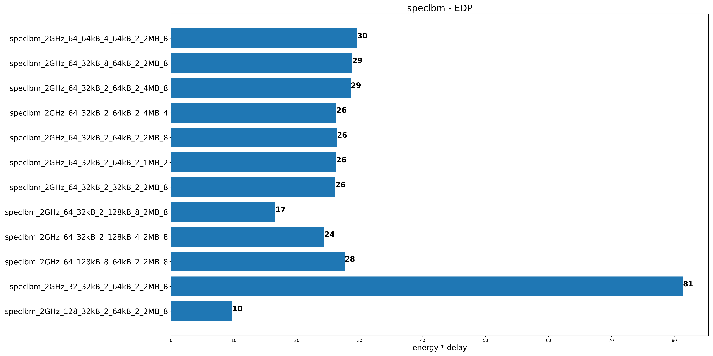

## Παρατηρήσεις

1. Αύξηση της data cache προκαλεί μείωση του EDP
2. Αύξηση της instruction cache προκαλεί αμελητέα μείωση του EDP (η διαφορά
   φαίνεται
   μόνο στα speclbm και specjeng) (γραμμές 2η και 3η απ’ το τέλος)
3. Μείωση της L2 cache προκαλεί μικρή μείωση του EDP (γραμμές 3η και 5η)
4. Αύξηση της cache line size προκαλεί μείωση του EDP (γραμμές 8η και 9η)
   Ιδιαίτερη σημασία στα specjeng και speclbm παίζει το cache line size (βλ.
   τελευταίες
   γραμμές)
