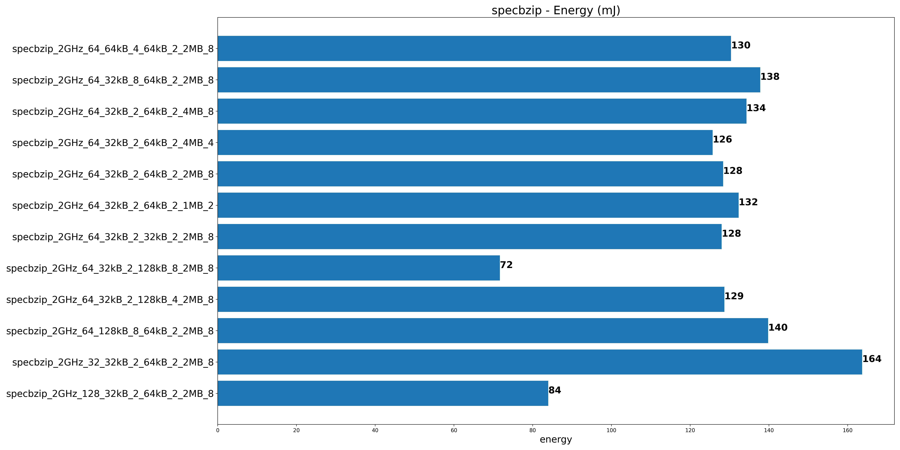
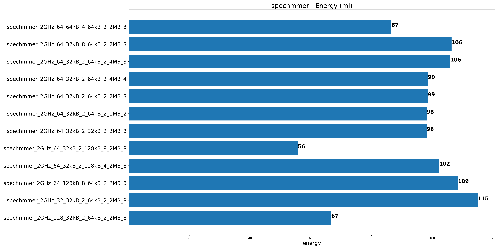
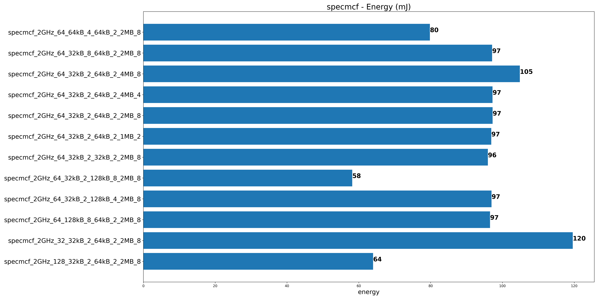
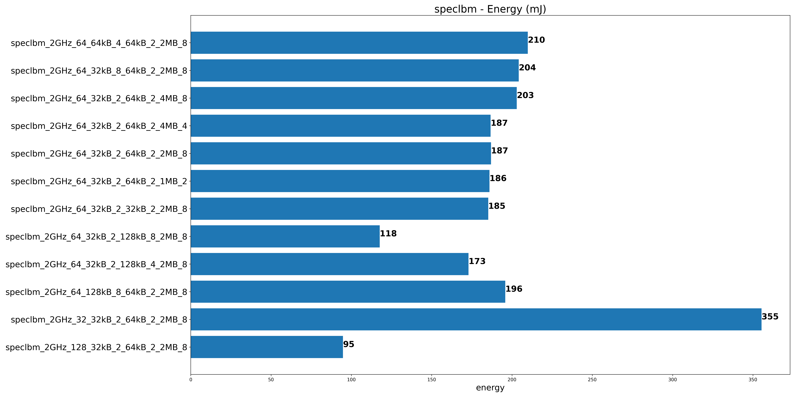
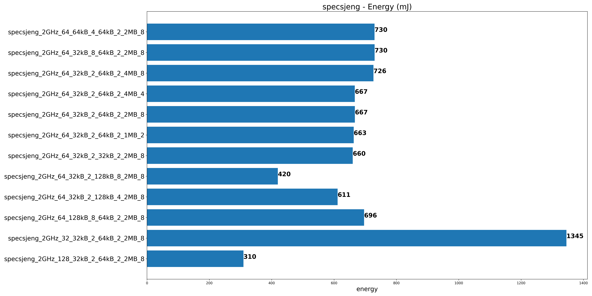

## Παρατηρήσεις

1. Την λιγότερη ενέργεια την βλέπουμε όταν αυξάνουμε την data cache.
2. Συγκεκριμένα στα benchmark lbm και sjeng όταν αυξάνουμε την cache line size.
3. Γενικότερα CPU με καλύτερο CPI δηλαδή μικρότερο χρόνο εκτέλεσης καταναλώνουν και την λιγότερη ενέργεια.
